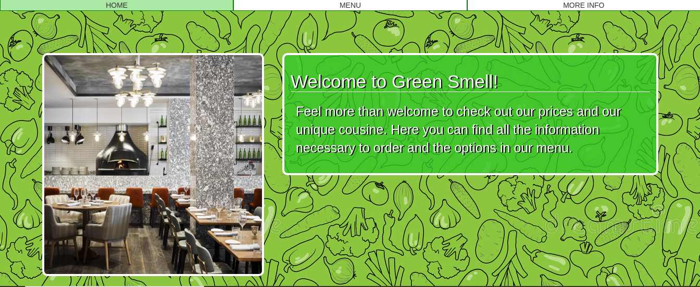

# Restaurant_page

> This project consists of developing a restaurant page using the recently aquired knowledge in webpack.

## Built With
- HTML & CSS
- JavaScript/ES6
- Webpack
- eslint
- style lint

## Live Demo

> [LiveDemoLink](https://chef-restaurant.netlify.app/) 

## Author

👤 **Alexandre Bouhid**

- Github: [@abouhid](https://github.com/abouhid)
- LinkedIn: [Alexandre Bouhid](https://www.linkedin.com/in/alexandrebouhid/)

## 🤝 Contributing

Contributions, issues and feature requests are welcome!

## Show your support

Give a ⭐️ if you like this project!

## 📝 License

This project is [MIT](lic.url) licensed.